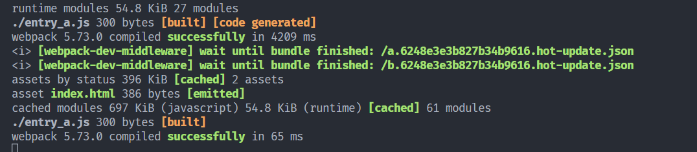

# DevServer

[webpack-dev-server](https://github.com/webpack/webpack-dev-server) 可用于快速开发应用程序。它提供了一些配置项可以改变 DevServer 的默认行为。 要配置 DevServer ，除了在配置文件里通过 devServer 传入参数外，还可以通过命令行参数传入。 注意只有在通过 DevServer 去启动 Webpack 时配置文件里 devServer 才会生效，因为这些参数所对应的功能都是 DevServer 提供的，Webpack 本身并不认识 devServer 配置项。

## devServer.port

指定监听请求的端口号：

**webpack.config.js**

```js
module.exports = {
  //...
  devServer: {
    port: 8080,
  },
};
```

## devServer.open

告诉 dev-server 在服务器已经启动后打开浏览器。设置其为 true 以打开你的默认浏览器。

**webpack.config.js**

```js
module.exports = {
  //...
  devServer: {
    open: true,
  },
};
```

## devServer.hot

启用 webpack 的 热模块替换 特性：

**webpack.config.js**

```js
module.exports = {
  //...
  devServer: {
    hot: true,
  },
};
```

> 从 webpack-dev-server v4 开始，HMR 是默认启用的。它会自动应用 webpack.HotModuleReplacementPlugin，这是启用 HMR 所必需的。因此当 hot 设置为 true 或者通过 CLI 设置 --hot，你不需要在你的 webpack.config.js 添加该插件。

当我们使用 dev-server 启动 webpack 服务时，在文件中引入并使用某个模块时，webpack 会自动替我们加载更新这个模块，通过控制日志就可以看出热更新日志，并且页面效果也已经实时刷新



## devServer.https

默认情况下，开发服务器将通过 HTTP 提供服务。可以选择使用 HTTPS 提供服务：

**webpack.config.js**

```js
module.exports = {
  //...
  devServer: {
    https: true,
  },
};
```

### HTTP

（HyperText Transfer Protocol：超文本传输协议）是一种用于分布式、协作式和超媒体信息系统的应用层协议。 简单来说就是一种发布和接收 HTML 页面的方法，被用于在 Web 浏览器和网站服务器之间传递信息。

HTTP 默认工作在 TCP 协议 80 端口，用户访问网站 http:// 打头的都是标准 HTTP 服务。

HTTP 协议以明文方式发送内容，不提供任何方式的数据加密，如果攻击者截取了 Web 浏览器和网站服务器之间的传输报文，就可以直接读懂其中的信息，因此，HTTP 协议不适合传输一些敏感信息，比如：信用卡号、密码等支付信息。

### HTTPS

（Hypertext Transfer Protocol Secure：超文本传输安全协议）是一种透过计算机网络进行安全通信的传输协议。HTTPS 经由 HTTP 进行通信，但利用 SSL/TLS 来加密数据包。HTTPS 开发的主要目的，是提供对网站服务器的身份认证，保护交换数据的隐私与完整性。

### HTTP 与 HTTPS 区别

- HTTP 明文传输，数据都是未加密的，安全性较差，HTTPS（SSL+HTTP） 数据传输过程是加密的，安全性较好。
- 使用 HTTPS 协议需要到 CA（Certificate Authority，数字证书认证机构） 申请证书，一般免费证书较少，因而需要一定费用。证书颁发机构如：Symantec、Comodo、GoDaddy 和 GlobalSign 等。
- HTTP 页面响应速度比 HTTPS 快，主要是因为 HTTP 使用 TCP 三次握手建立连接，客户端和服务器需要交换 3 个包，而 HTTPS 除了 TCP 的三个包，还要加上 ssl 握手需要的 9 个包，所以一共是 12 个包。
- http 和 https 使用的是完全不同的连接方式，用的端口也不一样，前者是 80，后者是 443。
- HTTPS 其实就是建构在 SSL/TLS 之上的 HTTP 协议，所以，要比较 HTTPS 比 HTTP 要更耗费服务器资源。

## devServer.proxy

当拥有单独的 API 后端开发服务器并且希望在同一域上发送 API 请求时，代理某些 URL 可能会很有用。

使用后端在 localhost:3000 上，可以使用它来启用代理：

**webpack.config.js**

```js
module.exports = {
  //...
  devServer: {
    proxy: {
      "/api": "http://localhost:3000",
    },
  },
};
```

下面我们通过一个例子来具体配置一下 devServer.proxy

1. 本地搭建一个利用 express 搭建一个 node 服务端，并且创建一个 getUsers 的接口，使用 mockjs 模拟接口返回数据

```js
var express = require("express");
var Mock = require("mockjs");
var router = express.Router();

router.get("/getUsers", (req, res, next) => {
  const users = Mock.mock({
    "list|1-10": [
      {
        id: Mock.Random.id(),
        name: "@cname",
        email: Mock.Random.email(),
        address: `${Mock.Random.province()}${Mock.Random.city()}${Mock.Random.county()}`,
      },
    ],
  });
  res.send(users);
});
```

2. 在前端使用 fetch 发起请求，获取接口数据

```js
btn.onclick = () => {
  fetch("/api/users/getUsers", {
    method: "GET",
    mode: "cors",
  })
    .then((res) => {
      if (res.ok) {
        res.json().then((data) => {
          console.log(data.list);
        });
      }
    })
    .catch((err) => {
      alert(err.message);
    });
};
```

### devServer.proxy.target

除了上述直接以字符串的形式配置代理地址，还可以通过Object的形式去配置proxy，其中target就表示代理的目标地址

```js
module.exports = {
  //...
  devServer: {
    proxy: {
      "/api": {
        target: "http://localhost:3000",
      },
    },
  },
};
```

### devServer.proxy.changeOrigin

express启用的服务端口是`3000`，而前端启动的端口是我们设置的`8888`，所以当前端发起请求时端口不同就涉及到跨域问题，devServer为我们提供了`changeOrigin`选项，可以设置代理跨域

```js
module.exports = {
  //...
  devServer: {
    proxy: {
      "/api": {
        target: "http://localhost:3000",
        changeOrigin: true,
      },
    },
  },
};
```

### devServer.proxy.pathRewrite

通过浏览器发现我们的请求地址中`http://localhost:8888/api/users/getUsers`中带有`/api`(代理名称)。但是物品们并不需要这个字段，devServer也为我们提供了相关配置字段去替换代理名称：

```js
module.exports = {
  //...
  devServer: {
    proxy: {
      "/api": {
        target: "http://localhost:3000",
        changeOrigin: true,
        pathRewrite: {
          "^/api": "",
        },
      },
    },
  },
};
```

至此，我们就可以正式的去访问node服务端通过请求获取数据了。

