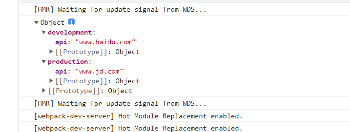

# 模式（mode）

提供 mode 配置选项，告知 webpack 使用相应模式的内置优化。

| 选项        | 描述                                                                                                                                                                                                                          |
| ----------- | ----------------------------------------------------------------------------------------------------------------------------------------------------------------------------------------------------------------------------- |
| development | 会将 DefinePlugin 中 process.env.NODE_ENV 的值设置为 development. 为模块和 chunk 启用有效的名。                                                                                                                               |
| production  | 会将 DefinePlugin 中 process.env.NODE_ENV 的值设置为 production。为模块和 chunk 启用确定性的混淆名称，FlagDependencyUsagePlugin，FlagIncludedChunksPlugin，ModuleConcatenationPlugin，NoEmitOnErrorsPlugin 和 TerserPlugin 。 |
| none        | 不使用任何默认优化选项                                                                                                                                                                                                        |

如果没有设置，webpack 会给 mode 的默认值设置为 production。

## DefinePlugin

DefinePlugin是webpack本身自带的一个插件，用于允许创建一个在编译时可以配置的全局常量。

1. 这是一个定义全局变量的插件,定义的变量可以在webpack打包范围内任意javascript环境内访问,甚至在项目根目录之外的js里也可以使用
2. 使用字符串或JSON.stringify()转换值,推荐使用JSON.stringify(),可以转换json对象

```js
const envConfig = {
  development: {
    api: 'www.baidu.com'
  },
  production: {
    api: 'www.jd.com'
  }
}

module.exports = {
  ...
  plugins: [
    new webpack.DefinePlugin({
      envConfig: JSON.stringify(envConfig)
    })
  ]
  ...
}
```

定义后我们就可以在任何js文件中访问，在index.js中打印`envConfig`

```js
console.log(envConfig);
```



## EnvironmentPlugin

EnvironmentPlugin 是一个通过 DefinePlugin 来设置 process.env 环境变量的快捷方式。

EnvironmentPlugin 可以接收键数组或将键映射到其默认值的对象。、

```js
new webpack.EnvironmentPlugin(['NODE_ENV', 'DEBUG']);
```

其效果等同于

```js
new webpack.DefinePlugin({
  'process.env.NODE_ENV': JSON.stringify(process.env.NODE_ENV),
  'process.env.DEBUG': JSON.stringify(process.env.DEBUG)
});
```

>使用不存在的环境变量会导致一个 "EnvironmentPlugin - ${key} environment variable is undefined" 错误。

因此要创建一个不存在的环境变量时，可以采用对象赋值的形式去设置默认值

```js
new webpack.EnvironmentPlugin({
  NODE_ENV: 'development', // 除非有定义 process.env.NODE_ENV，否则就使用 'development'
  DEBUG: false
});
```

**模式或者环境变量主要时用于开发环境和生产环境之间一些不同的配置，尽可能的复用代码，在构建的过程中需要根据目标代码要运行的环境而输出不同的代码**
