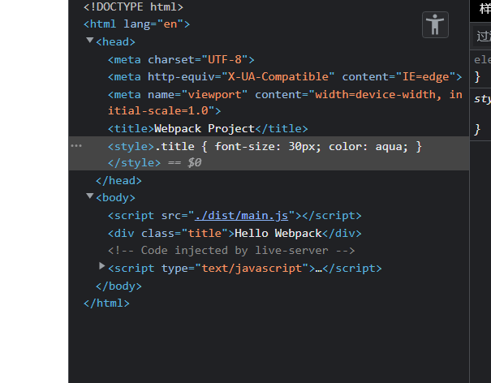

# 使用loader

我们已经通过webpack构建了一个简单的项目，现在通过loader（模块转换器）去处理一些不同的模块文件

## css-loader

Webpack 不原生支持解析 CSS 文件，所以需要通过css-loader帮助我们处理css文件

安装css文件处理所需的loader

```bash
npm i -D style-loader css-loader
```

修改webpack.config.js配置文件

```js
const path = require("path");

module.exports = {
  entry: './index.js',
  output: {
    path: path.resolve(__dirname, './dist'),
  },
  // 配置处理不同类型的模块
  module: {
    // 模块处理规则
    rules: [
      {
        // 所有后缀名为.css的文件指定使用style-loader，css-loader转换处理
        test: /\.css$/,
        use: ["style-loader", "css-loader"],
      },
    ],
  }
};
```

现在开始给页面添加css样式

- 在index.css中添加样式
  
```css
.title {
  font-size: 20px;
  color: aqua;
}
```

- 在index.js中引入并使用该样式

```js
import "./index.css";

function components() {
  var element = document.createElement("div");
  element.innerHTML = ["Hello", "Webpack"].join(" ");
  element.className = "title";
  return element;
}

document.body.appendChild(components());
```

- 执行`npm run build`重新构建项目工程

现在在浏览器中打开index.html，就可以发现页面文字的样式已经发生，并且查看浏览器的元素时会发现css样式文件已经自动加载在`head`中



### 其他loader

- [webpack官网列出的常用loader](https://www.webpackjs.com/loaders/)
- [vue-loader](https://vue-loader.vuejs.org/zh/)